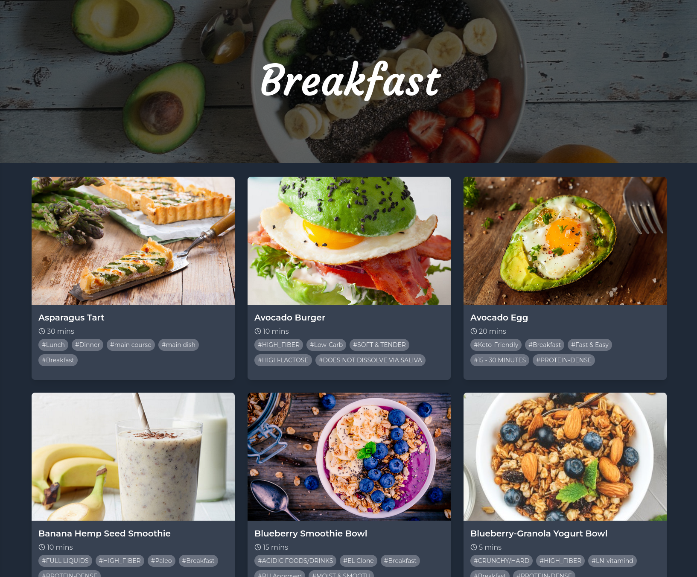

# Yummy 🍽️

Yummy is a modern web application designed for searching and sharing recipes. It leverages the power of the Internet Computer (IC), providing a decentralized and scalable solution.

## Screenshots

### Home Page


### Recipes

You can scroll through lots of recipes and click on them to see full description.




### Adding new recipes

After logging with Internet Identity you can share your recipes with other users.


### Searching system

The user can search through all recipes. After entering some search query you can navigate through options with arrows and choose one of the options by cicking enter.


### Mobile view

The website is fully responsive and interactive so you can also use it on your phone.


## Features

- **User-Friendly UI:** Intuitive, responsive, and easy-to-use interface for a seamless user experience.
- **Authentication with Internet Identity** Securely log in using your Internet Identity, providing a seamless and secure authentication experience.
- **Internet Computer Integration:** Utilizes the Internet Computer network for a scalable, decentralized infrastructure.
- **Storing images and data on ICP** When adding recipes, users can select an image to show the dish after preparation. All recipes are stored on the blockchain.
- **Searching sytem** User can search through all recipes by names after pressing ctrl + k or clicking a button.
- **Recipe Sharing - creating recipes** Discover and share a variety of recipes with the community.
- **Displaying every single recipe** When you click on a recipe, you can view its full description.
- **Deleting recipes** You can always remove the recipe if you are not happy with it.

## Future features 📌

- **Expanding the search system** - enable searching by tags and preparation time
- **Adding user feedback** - ability to add comments to recipes
- **Recipes likes** - add possibility to like a recipe
- **Extension of information about user**
- **Ability to edit recipe after adding**

## Technologies 🛠️

- **[Rust 🦀](https://github.com/rust-lang/rust)** for backend
- **[Vue.js](https://github.com/vuejs/core)** for frontend
- \*\*[Vue Router](https://github.com/vuejs/router) for multiple pages
- **[Pinia 🍍](https://github.com/vuejs/pinia)** for state management
- **[TailwindCSS 🍃](https://github.com/tailwindlabs/tailwindcss)** for styling
- **[DfinityCDK](https://github.com/dfinity/cdk-rs)** for compiling to the Internet Computer
- **[Stable structures](https://github.com/dfinity/stable-structures)** for storing data that persist across upgrades.

## Getting Started

### Prerequisites

- Node.js (>= 16)
- npm (>= 7)
- [dfx](https://internetcomputer.org/docs/current/developer-docs/build/install-upgrade-remove) (DFINITY Canister SDK)

### Running the Project Locally

1. **Clone the Repository:**

   ```sh
   git clone https://github.com/Gibirizon/yummy.git
   cd yummy
   ```

2. **Install Dependencies:**

   ```sh
   npm install
   ```

3. **Start the Internet Computer Replica:**

   ```sh
   dfx start --background
   ```

4. **Deploy the Canisters:**

   ```sh
   dfx deploy
   ```

5. **Run the Development Server:**

   ```sh
   npm start
   ```

   Access the application at `http://localhost:3000`. The development server proxies API requests to the IC replica running on port 4943.

Enjoy discovering and sharing recipes on Yummy!🍳👨‍🍳👩‍🍳
